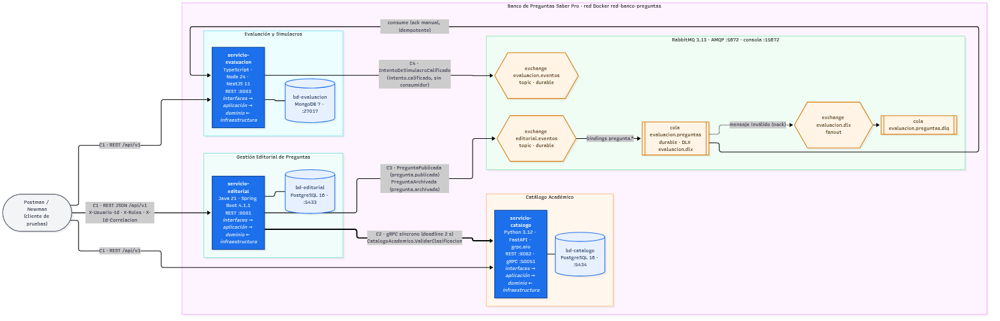

# Banco de Preguntas Saber Pro · Taller 2

## 1. Descripción

Sistema de microservicios para construir, revisar y publicar preguntas tipo Saber Pro y armar simulacros con ellas. Implementa en código los tres contextos delimitados diseñados en el Taller 1. Las reglas y los contratos están en [CONTRATOS.md](CONTRATOS.md) (fuente única de verdad) y el modelo de dominio en [MODELO-DOMINIO.md](MODELO-DOMINIO.md).

| Servicio | Contexto (Taller 1) | Qué hace | Tecnología | Puertos |
|---|---|---|---|---|
| [`servicio-editorial`](servicio-editorial/README.md) | Gestión Editorial de Preguntas | Crea preguntas, las valida, coordina la revisión por pares, las publica y archiva. Valida la clasificación con Catálogo por gRPC y emite `PreguntaPublicada` y `PreguntaArchivada`. | Java 21 · Spring Boot 4.1.1 · PostgreSQL 16 | 8081 |
| [`servicio-catalogo`](servicio-catalogo/README.md) | Catálogo Académico | Competencias, temas y subtemas. Publica el servicio gRPC `CatalogoAcademico.ValidarClasificacion`. | Python 3.12 · FastAPI · PostgreSQL 16 | 8082 (REST) · 50051 (gRPC) |
| [`servicio-evaluacion`](servicio-evaluacion/README.md) | Evaluación y Simulacros | Guarda copias de las preguntas publicadas (por eventos), arma simulacros, recibe intentos y los califica; emite `IntentoDeSimulacroCalificado`. | TypeScript · Node 24 · NestJS 11 · MongoDB 7 | 8083 |

Infraestructura común: RabbitMQ 3.13 y una base de datos por servicio, todo con Docker Compose.

## 2. Arquitectura



Detalle de cada elemento, el diagrama de secuencia del flujo principal y la justificación de gRPC y de los eventos en [docs/arquitectura/README.md](docs/arquitectura/README.md).

## 3. Requisitos

- [Docker](https://docs.docker.com/get-docker/) con **Docker Compose v2** (`docker compose version`). No hace falta instalar Java, Python ni Node: todo se construye dentro de contenedores.
- Puertos libres: 8081, 8082, 8083, 50051, 5672, 15672, 5433, 5434 y 27017.
- Opcional: [Postman](https://www.postman.com/downloads/) y [grpcurl](https://github.com/fullstorydev/grpcurl) (ambos tienen alternativa con Docker).

## 4. Cómo ejecutar

```bash
cp .env.example .env                                  # variables por defecto (CONTRATOS.md 9.2)
docker compose --profile servicios up -d --build      # infraestructura + los 3 servicios
docker compose --profile servicios ps                 # esperar 7 contenedores "healthy"
```

En PowerShell el primer paso es `Copy-Item .env.example .env`. La primera construcción tarda varios minutos (descarga las dependencias de Maven, pip y npm).

- Solo la infraestructura (RabbitMQ y las 3 bases de datos): `docker compose up -d`.
- Detener **conservando los datos**: `docker compose --profile servicios down`.
- Detener **borrando los datos** (volúmenes): `docker compose --profile servicios down -v`.

## 5. URLs y puertos

| Qué | Editorial | Catálogo | Evaluación |
|---|---|---|---|
| API REST | http://localhost:8081/api/v1 | http://localhost:8082/api/v1 | http://localhost:8083/api/v1 |
| Swagger UI | http://localhost:8081/docs | http://localhost:8082/docs | http://localhost:8083/docs |
| OpenAPI | http://localhost:8081/openapi.json | http://localhost:8082/openapi.json | http://localhost:8083/openapi.json |
| Salud | http://localhost:8081/salud | http://localhost:8082/salud | http://localhost:8083/salud |

| Otros | Dirección |
|---|---|
| gRPC de Catálogo (sin TLS, con reflexión) | `localhost:50051` |
| Consola de RabbitMQ (usuario `banco`, clave `banco123`) | http://localhost:15672 |
| AMQP | `localhost:5672` |
| PostgreSQL editorial / catálogo | `localhost:5433` / `localhost:5434` |
| MongoDB evaluación | `localhost:27017` |

Todas las peticiones a `/api/v1` llevan la identidad en encabezados: `X-Usuario-Id` (UUID), `X-Roles` (`AUTOR`, `REVISOR`, `ADMINISTRADOR`, `DOCENTE`, `ESTUDIANTE`, separados por coma) y, opcional, `X-Id-Correlacion` (CONTRATOS.md 4.1). Los usuarios de prueba están en CONTRATOS.md 4.2.

## 6. Cómo probar

### Postman

Importe [postman/BancoPreguntas.postman_collection.json](postman/BancoPreguntas.postman_collection.json) y [postman/local.postman_environment.json](postman/local.postman_environment.json), seleccione el entorno **local** y ejecute la colección completa en orden con el *Collection Runner*. Carpetas: `01 Catálogo`, `02 Editorial`, `03 Evaluación`, `04 Flujo completo` (demostración de punta a punta), `05 Flujo de rechazo` y `06 Casos comunes`. Detalle en [postman/README.md](postman/README.md).

### Newman (sin instalar nada)

```bash
# Linux, macOS o Git Bash (en Git Bash agrega antes: export MSYS_NO_PATHCONV=1)
docker run --rm --network red-banco-preguntas -v "$PWD/postman:/etc/newman" postman/newman:6-alpine \
  run BancoPreguntas.postman_collection.json -e local.postman_environment.json \
  --env-var urlEditorial=http://servicio-editorial:8081/api/v1 \
  --env-var urlCatalogo=http://servicio-catalogo:8082/api/v1 \
  --env-var urlEvaluacion=http://servicio-evaluacion:8083/api/v1 \
  --reporters cli,json --reporter-json-export resultados/newman-resultado.json
```

```powershell
# Windows (PowerShell)
docker run --rm --network red-banco-preguntas -v "${PWD}/postman:/etc/newman" postman/newman:6-alpine `
  run BancoPreguntas.postman_collection.json -e local.postman_environment.json `
  --env-var urlEditorial=http://servicio-editorial:8081/api/v1 `
  --env-var urlCatalogo=http://servicio-catalogo:8082/api/v1 `
  --env-var urlEvaluacion=http://servicio-evaluacion:8083/api/v1 `
  --reporters cli,json --reporter-json-export resultados/newman-resultado.json
```

El reporte queda en `postman/resultados/newman-resultado.json`.

### gRPC con grpcurl

El servidor gRPC de `servicio-catalogo` (puerto `50051`, sin TLS) tiene la **reflexión activada**, así que `grpcurl` no necesita el archivo `.proto`. Primero levanta el servicio:

```bash
docker compose --profile servicios up -d servicio-catalogo
```

Hay dos formas de ejecutar `grpcurl`. Las dos usan los identificadores de la tabla 4.3 de [CONTRATOS.md](CONTRATOS.md).

**A. Desde el equipo** (con [grpcurl](https://github.com/fullstorydev/grpcurl) instalado, contra el puerto publicado `localhost:50051`):

```bash
# Servicios y método disponibles
grpcurl -plaintext localhost:50051 list
grpcurl -plaintext localhost:50051 list bancopreguntas.catalogo.v1.CatalogoAcademico
grpcurl -plaintext localhost:50051 describe bancopreguntas.catalogo.v1.CatalogoAcademico

# Terna VÁLIDA (competencia …101, tema …201, subtema …301) -> "valida": true
grpcurl -plaintext -emit-defaults \
  -d '{"competencia_id":"22222222-2222-4222-8222-000000000101","tema_id":"22222222-2222-4222-8222-000000000201","subtema_id":"22222222-2222-4222-8222-000000000301"}' \
  localhost:50051 bancopreguntas.catalogo.v1.CatalogoAcademico/ValidarClasificacion

# Terna INVÁLIDA: el subtema …303 es del tema …202, no del …201
# -> "motivo": "MOTIVO_RECHAZO_SUBTEMA_NO_PERTENECE_A_TEMA" (respuesta OK, no es un error gRPC)
grpcurl -plaintext \
  -d '{"competencia_id":"22222222-2222-4222-8222-000000000101","tema_id":"22222222-2222-4222-8222-000000000201","subtema_id":"22222222-2222-4222-8222-000000000303"}' \
  localhost:50051 bancopreguntas.catalogo.v1.CatalogoAcademico/ValidarClasificacion

# Id mal formado -> estado gRPC InvalidArgument
grpcurl -plaintext \
  -d '{"competencia_id":"22222222-2222-4222-8222-000000000101","tema_id":"no-es-uuid","subtema_id":"22222222-2222-4222-8222-000000000301"}' \
  localhost:50051 bancopreguntas.catalogo.v1.CatalogoAcademico/ValidarClasificacion

# Con correlación: aparece en el log del servicio (idCorrelacion=...)
grpcurl -plaintext -H 'x-id-correlacion: 0b6f2c4e-1d3a-4e5f-8a7b-9c0d1e2f3a4b' \
  -d '{"competencia_id":"22222222-2222-4222-8222-000000000101","tema_id":"22222222-2222-4222-8222-000000000201","subtema_id":"22222222-2222-4222-8222-000000000302"}' \
  localhost:50051 bancopreguntas.catalogo.v1.CatalogoAcademico/ValidarClasificacion
```

**B. Desde la red de Docker** (sin instalar nada: se usa la imagen `fullstorydev/grpcurl` y el host `servicio-catalogo`). En Git Bash de Windows agrega antes `export MSYS_NO_PATHCONV=1`.

```bash
docker run --rm --network red-banco-preguntas fullstorydev/grpcurl -plaintext servicio-catalogo:50051 list

docker run --rm --network red-banco-preguntas fullstorydev/grpcurl -plaintext servicio-catalogo:50051 \
  describe bancopreguntas.catalogo.v1.CatalogoAcademico

# Terna válida
docker run --rm --network red-banco-preguntas fullstorydev/grpcurl -plaintext -emit-defaults \
  -d '{"competencia_id":"22222222-2222-4222-8222-000000000101","tema_id":"22222222-2222-4222-8222-000000000201","subtema_id":"22222222-2222-4222-8222-000000000301"}' \
  servicio-catalogo:50051 bancopreguntas.catalogo.v1.CatalogoAcademico/ValidarClasificacion

# Subtema de otro tema -> MOTIVO_RECHAZO_SUBTEMA_NO_PERTENECE_A_TEMA
docker run --rm --network red-banco-preguntas fullstorydev/grpcurl -plaintext \
  -d '{"competencia_id":"22222222-2222-4222-8222-000000000101","tema_id":"22222222-2222-4222-8222-000000000201","subtema_id":"22222222-2222-4222-8222-000000000303"}' \
  servicio-catalogo:50051 bancopreguntas.catalogo.v1.CatalogoAcademico/ValidarClasificacion

# Id mal formado -> Code: InvalidArgument
docker run --rm --network red-banco-preguntas fullstorydev/grpcurl -plaintext \
  -d '{"competencia_id":"22222222-2222-4222-8222-000000000101","tema_id":"no-es-uuid","subtema_id":"22222222-2222-4222-8222-000000000301"}' \
  servicio-catalogo:50051 bancopreguntas.catalogo.v1.CatalogoAcademico/ValidarClasificacion
```

Los otros motivos de rechazo se obtienen cambiando un identificador (usa uno que no exista, por ejemplo `99999999-9999-4999-8999-999999999999`):

| Terna enviada | `motivo` |
|---|---|
| competencia inexistente | `MOTIVO_RECHAZO_COMPETENCIA_INEXISTENTE` |
| competencia `…101`, tema inexistente | `MOTIVO_RECHAZO_TEMA_INEXISTENTE` |
| competencia `…101`, tema `…203` (de la `…102`), subtema `…304` | `MOTIVO_RECHAZO_TEMA_NO_PERTENECE_A_COMPETENCIA` |
| competencia `…101`, tema `…201`, subtema inexistente | `MOTIVO_RECHAZO_SUBTEMA_INEXISTENTE` |
| competencia `…101`, tema `…201`, subtema `…303` (del tema `…202`) | `MOTIVO_RECHAZO_SUBTEMA_NO_PERTENECE_A_TEMA` |

> `grpcurl` no imprime los campos con valor por defecto: una terna válida muestra `"valida": true` pero omite `"motivo": "MOTIVO_RECHAZO_NINGUNO"`. Agrega `-emit-defaults` para verlo.
>
> En Postman: crea una petición gRPC a `localhost:50051` y usa «Using server reflection» para cargar `CatalogoAcademico/ValidarClasificacion`.

### Publicar eventos de ejemplo hacia Evaluación

Sin pasar por Editorial, el script de `servicio-evaluacion` publica en `editorial.eventos` los ejemplos de `/contratos/eventos/ejemplos/` (incluido uno con un campo extra, que demuestra el lector tolerante):

```bash
./servicio-evaluacion/scripts/publicar-ejemplos.sh        # bash / Git Bash
./servicio-evaluacion/scripts/publicar-ejemplos.ps1       # PowerShell
```

Detalle y variables opcionales en [servicio-evaluacion/README.md](servicio-evaluacion/README.md).

### Validar los contratos

```bash
./scripts/validar-contratos.sh                                          # Linux, macOS o Git Bash
powershell -ExecutionPolicy Bypass -File .\scripts\validar-contratos.ps1   # Windows
```

Compila `catalogo_academico.proto` con `grpcio-tools` y valida cada ejemplo de `contratos/eventos/ejemplos/` contra su JSON Schema, dentro de un contenedor `python:3.12-slim`. Imprime OK o ERROR por archivo y termina con código distinto de 0 si algo falla.

### Pruebas automáticas de cada servicio

Cada README de servicio explica cómo correr sus pruebas unitarias y de integración (por ejemplo `mvn verify` en `servicio-editorial`, que además deja el reporte de cobertura de JaCoCo en `target/site/jacoco-combinado/`).

## 7. Comunicación entre servicios

| # | Tipo | Origen → Destino | Contrato |
|---|---|---|---|
| C1 | REST síncrono | Postman → cada servicio | APIs `/api/v1/...` (CONTRATOS.md 8) |
| C2 | gRPC síncrono (*deadline* 2 s) | `servicio-editorial` → `servicio-catalogo` | `CatalogoAcademico.ValidarClasificacion` · [contratos/proto/catalogo/v1/catalogo_academico.proto](contratos/proto/catalogo/v1/catalogo_academico.proto) (CONTRATOS.md 6) |
| C3 | Evento asíncrono | `servicio-editorial` → exchange `editorial.eventos` → cola `evaluacion.preguntas` → `servicio-evaluacion` | `PreguntaPublicada` y `PreguntaArchivada` · [contratos/eventos/editorial/](contratos/eventos/editorial/) (CONTRATOS.md 7.4 y 7.5) |
| C4 | Evento asíncrono | `servicio-evaluacion` → exchange `evaluacion.eventos` | `IntentoDeSimulacroCalificado`, hoy sin consumidor · [contratos/eventos/evaluacion/](contratos/eventos/evaluacion/) (CONTRATOS.md 7.6) |

Ningún servicio llama por REST a otro servicio ni lee la base de datos de otro. Ejemplos de eventos en [contratos/eventos/ejemplos/](contratos/eventos/ejemplos/) y guía de los contratos en [contratos/README.md](contratos/README.md).

## 8. Estructura del repositorio

```
├── CONTRATOS.md            fuente única de verdad (contratos, puertos, variables, eventos)
├── MODELO-DOMINIO.md       modelo de dominio del Taller 1 + ajustes del Taller 2
├── docker-compose.yml      infraestructura y servicios (perfil "servicios")
├── .env.example            variables por defecto
├── contratos/              proto gRPC y esquemas JSON de eventos (con ejemplos)
├── docs/
│   ├── arquitectura/       diagramas de arquitectura y del flujo principal (entregable)
│   └── prompts/            instrucciones de las etapas de trabajo con agentes
├── postman/                colección, entorno, README y resultados de Newman
├── scripts/                validación de contratos
├── servicio-editorial/     P1 · Java · Spring Boot
├── servicio-catalogo/      P3 · Python · FastAPI
└── servicio-evaluacion/    P2 · TypeScript · NestJS
```

`/contratos`, `CONTRATOS.md`, `docker-compose.yml`, `/postman` y `/scripts` solo se cambian por PR aprobado por al menos otro integrante (ver [.github/CODEOWNERS](.github/CODEOWNERS)).

## 9. Documentación

| Documento | Contenido |
|---|---|
| [CONTRATOS.md](CONTRATOS.md) | Contratos REST, gRPC y de eventos, errores, identidad, variables y reglas de construcción. |
| [MODELO-DOMINIO.md](MODELO-DOMINIO.md) | Invariantes INV-xx, decisiones D-xx y casos de uso CU-xx del Taller 1, con los ajustes del Taller 2. |
| [docs/arquitectura/README.md](docs/arquitectura/README.md) | Diagramas y decisiones de comunicación. |
| [servicio-editorial/README.md](servicio-editorial/README.md) · [DUDAS.md](servicio-editorial/DUDAS.md) | Servicio editorial y sus dudas resueltas o abiertas. |
| [servicio-catalogo/README.md](servicio-catalogo/README.md) · [DUDAS.md](servicio-catalogo/DUDAS.md) | Servicio de catálogo y sus dudas. |
| [servicio-evaluacion/README.md](servicio-evaluacion/README.md) | Servicio de evaluación. |
| [postman/README.md](postman/README.md) | Colección de Postman y Newman. |
| [contratos/README.md](contratos/README.md) | Guía de la carpeta de contratos. |

## 10. Equipo

| Integrante | Servicio | GitHub |
|---|---|---|
| P1 | `servicio-editorial` | [@juanvec06](https://github.com/juanvec06) |
| P2 | `servicio-evaluacion` | [@JDiegoG12](https://github.com/JDiegoG12) |
| P3 | `servicio-catalogo` | [@JuanDv1](https://github.com/JuanDv1) |

## 11. Problemas comunes

| Síntoma | Causa probable | Qué hacer |
|---|---|---|
| `Bind for 0.0.0.0:XXXX failed: port is already allocated` | Otro programa o contenedor usa el puerto (por ejemplo un RabbitMQ o PostgreSQL local). | Detenga el otro proceso (`docker ps` para ver contenedores) o cambie el puerto publicado en `.env`/`docker-compose.yml` mediante un PR. |
| Un servicio queda en `starting` o `unhealthy` | Su base de datos o RabbitMQ aún no están listos, o falló al arrancar. | `docker compose --profile servicios ps` para ver el estado; los servicios se reinician solos (`restart: unless-stopped`). Si persiste, revise los logs. |
| Editorial responde 503 `BASE_DE_DATOS_NO_DISPONIBLE` justo después de arrancar | Las migraciones de Flyway aún se están aplicando. | Espere unos segundos; `/salud` responde 200 mientras tanto. |
| Crear una pregunta da 503 `CATALOGO_NO_DISPONIBLE` | `servicio-catalogo` no está `healthy` o no respondió en 2 s. | Revise `docker compose logs servicio-catalogo`. |
| Ver logs | — | `docker compose logs -f servicio-editorial` (o el servicio que corresponda). Cada línea lleva `idCorrelacion=`, el mismo valor del encabezado `X-Id-Correlacion` de la respuesta. |
| Una pregunta publicada no aparece en Evaluación | El evento no se consumió o terminó en la cola de mensajes muertos. | Consola de RabbitMQ (http://localhost:15672) → *Queues*: revise `evaluacion.preguntas` y `evaluacion.preguntas.dlq` («Get messages» muestra el mensaje rechazado). Los logs de `servicio-evaluacion` indican el motivo. |
| Datos de ejecuciones anteriores estorban | Los volúmenes conservan los datos. | `docker compose --profile servicios down -v` y vuelva a levantar (la siembra del catálogo se carga de nuevo). |
| En Git Bash de Windows las rutas de `docker run -v` fallan | Git Bash convierte las rutas al estilo Windows. | `export MSYS_NO_PATHCONV=1` antes del comando, o use PowerShell. |
