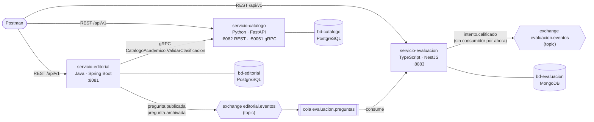

# Arquitectura · Banco de Preguntas Saber Pro (Taller 2)

Esta carpeta contiene el **diagrama de arquitectura** del sistema, que es un entregable del taller (responsable: P3).

> TODO: reemplazar o complementar el diagrama de partida con la versión final del entregable (por ejemplo, exportada como imagen o PDF y guardada en esta carpeta).

## Diagrama de partida

Tomado de [CONTRATOS.md](../../CONTRATOS.md), sección 1. Si el contrato cambia, este diagrama debe actualizarse en el mismo PR.

## Comunicaciones del sistema

| # | Tipo | Origen → Destino | Contrato |
|---|---|---|---|
| C1 | REST | Postman → cada servicio | APIs `/api/v1/...` (CONTRATOS.md §8) |
| C2 | gRPC síncrono | `servicio-editorial` → `servicio-catalogo` | `CatalogoAcademico.ValidarClasificacion` (§6) |
| C3 | Evento asíncrono | `servicio-editorial` → RabbitMQ → `servicio-evaluacion` | `PreguntaPublicada`, `PreguntaArchivada` (§7) |
| C4 | Evento asíncrono | `servicio-evaluacion` → RabbitMQ | `IntentoDeSimulacroCalificado`, sin consumidor (§7) |

Ningún servicio lee la base de datos de otro y ningún servicio llama por REST a otro servicio.
