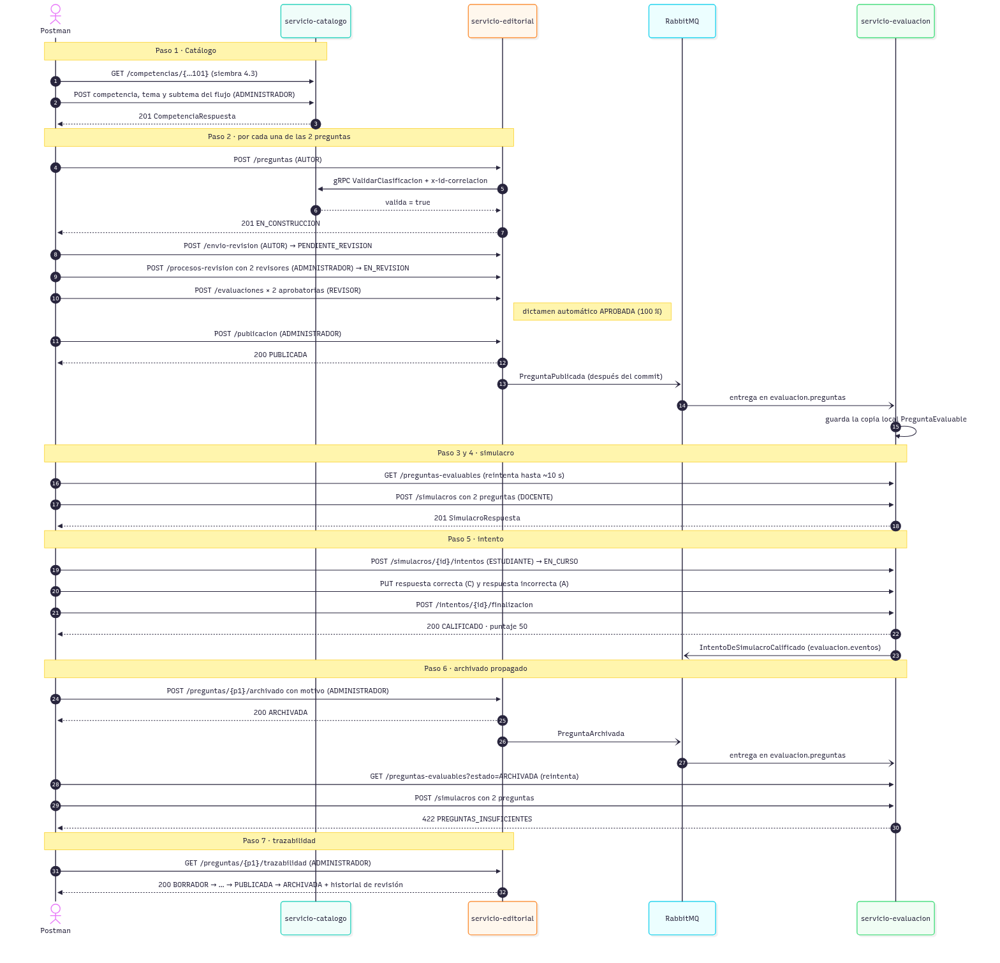

# Arquitectura · Banco de Preguntas Saber Pro (Taller 2)

Esta carpeta contiene el **diagrama de arquitectura** del sistema, que es un entregable del taller, y el diagrama de secuencia del flujo principal. Las fuentes están en Mermaid (`.mmd`) y las imágenes (`.png` y `.svg`) se generan a partir de ellas. Si cambia CONTRATOS.md (secciones 1, 6 o 7), los diagramas se actualizan en el mismo PR.

| Archivo | Contenido |
|---|---|
| [arquitectura.mmd](arquitectura.mmd) → [PNG](arquitectura.png) · [SVG](arquitectura.svg) | Diagrama de contenedores (estilo C4): servicios, bases de datos, broker y comunicaciones C1 a C4. |
| [flujo-principal.mmd](flujo-principal.mmd) → [PNG](flujo-principal.png) · [SVG](flujo-principal.svg) | Diagrama de secuencia de la carpeta `04 Flujo completo` de la colección de Postman (CONTRATOS.md 10). |

## Diagrama de contenedores


### Elementos

| Elemento | Tecnología | Responsabilidad |
|---|---|---|
| **Postman / Newman** | Colección `postman/BancoPreguntas.postman_collection.json` | Cliente de las pruebas. Envía la identidad en los encabezados `X-Usuario-Id`, `X-Roles` y `X-Id-Correlacion` (CONTRATOS.md 4.1). |
| **servicio-editorial** | Java 21 · Spring Boot 4.1.1 · REST :8081 | Contexto *Gestión Editorial de Preguntas*: crea y valida preguntas, coordina la revisión por pares, publica y archiva. Agregados `Pregunta` y `ProcesoDeRevision`. |
| **servicio-catalogo** | Python 3.12 · FastAPI · `grpc.aio` · REST :8082 · gRPC :50051 | Contexto *Catálogo Académico*: jerarquía Competencia → Tema → Subtema. Publica el servicio gRPC `CatalogoAcademico`. |
| **servicio-evaluacion** | TypeScript · Node 24 · NestJS 11 · REST :8083 | Contexto *Evaluación y Simulacros*: copia local de las preguntas publicadas, simulacros, intentos y calificación. |
| **bd-editorial**, **bd-catalogo** | PostgreSQL 16 (puertos de equipo 5433 y 5434) | Una base de datos por servicio. Ningún servicio lee la base de datos de otro. |
| **bd-evaluacion** | MongoDB 7 (27017) | Simulacros, intentos y la colección `preguntas_evaluables`. |
| **RabbitMQ** | 3.13 con consola (5672 y 15672) | Exchanges `editorial.eventos` y `evaluacion.eventos` (topic), cola `evaluacion.preguntas` con DLX `evaluacion.dlx` y cola de mensajes muertos `evaluacion.preguntas.dlq` (CONTRATOS.md 7.1). |

### Comunicaciones

| # | Tipo | Origen → Destino | Contrato |
|---|---|---|---|
| C1 | REST síncrono | Postman → cada servicio | APIs `/api/v1/...` (CONTRATOS.md 8) |
| C2 | gRPC síncrono, *deadline* 2 s | `servicio-editorial` → `servicio-catalogo` | `CatalogoAcademico.ValidarClasificacion` ([proto](../../contratos/proto/catalogo/v1/catalogo_academico.proto), CONTRATOS.md 6) |
| C3 | Evento asíncrono | `servicio-editorial` → `editorial.eventos` → `evaluacion.preguntas` → `servicio-evaluacion` | `PreguntaPublicada` (`pregunta.publicada`) y `PreguntaArchivada` (`pregunta.archivada`) (CONTRATOS.md 7.4 y 7.5) |
| C4 | Evento asíncrono | `servicio-evaluacion` → `evaluacion.eventos` | `IntentoDeSimulacroCalificado` (`intento.calificado`), hoy sin consumidor (CONTRATOS.md 7.6) |

Ningún servicio llama por REST a otro servicio. Los eventos se publican **después del commit** y el consumidor de Evaluación es idempotente y tolerante: un mensaje inválido termina en la DLQ (CONTRATOS.md 7.7).

### Capas internas de cada servicio

Los tres servicios siguen la misma Clean Architecture (CONTRATOS.md 3.3), con las dependencias apuntando hacia el dominio:

- **interfaces**: controladores REST (y el *servicer* gRPC en Catálogo, el consumidor AMQP en Evaluación). Traducen HTTP ↔ DTO y no contienen reglas de negocio.
- **aplicación**: un caso de uso por clase (CU-xx), puertos de entrada y de salida, DTOs.
- **dominio**: agregados, objetos de valor, invariantes INV-xx y eventos de dominio. No depende de ningún framework.
- **infraestructura**: adaptadores de los puertos de salida (repositorios JPA, SQLAlchemy o Mongoose, cliente gRPC, publicador RabbitMQ) y configuración.

### Por qué gRPC hacia Catálogo y un evento hacia Evaluación

Las dos decisiones salen del mapa de contextos del Taller 1 (resumido en CONTRATOS.md 1, 6 y 7 y en MODELO-DOMINIO.md):

- **Editorial → Catálogo es síncrono (gRPC).** Catálogo es un *Open Host Service* (CONTRATOS.md 6): publica un protocolo estable para validar una clasificación. Editorial **necesita la respuesta antes de guardar** la pregunta (INV-07: la terna competencia-tema-subtema debe existir y ser coherente), así que un evento no sirve: la pregunta no se puede aceptar "a la espera". gRPC aporta un contrato tipado (`.proto`), *deadline* explícito y metadatos para la correlación. Si Catálogo no responde en 2 s, Editorial responde 503 `CATALOGO_NO_DISPONIBLE` y no guarda nada.
- **Editorial → Evaluación es asíncrono (evento).** En el mapa de contextos, Evaluación es *downstream* de Editorial y solo necesita saber **que una pregunta se publicó o se archivó**: un hecho ya ocurrido que no necesita respuesta. Con un evento, Editorial no depende de que Evaluación esté disponible (la cola durable guarda los mensajes), y Evaluación mantiene su propia copia inmutable (`PreguntaEvaluable`, el «ítem cerrado» del Taller 1) para armar simulacros sin consultar a Editorial en cada intento. La consistencia es eventual: por eso la colección de Postman reintenta la consulta de preguntas evaluables hasta ~10 s.
- **Evaluación → `evaluacion.eventos`** sigue la relación *Customer/Supplier* del Taller 1 con el futuro `servicio-seguimiento`: el evento ya se emite aunque hoy nadie lo consuma (CONTRATOS.md 7.6).

## Flujo principal



Corresponde a la carpeta `04 Flujo completo` de la colección de Postman: catálogo → 2 preguntas revisadas y publicadas → evento → simulacro e intento calificado (puntaje 50) → archivado propagado → 422 `PREGUNTAS_INSUFICIENTES` → trazabilidad.

## Regenerar las imágenes

Solo se necesita Docker (imagen [`minlag/mermaid-cli`](https://hub.docker.com/r/minlag/mermaid-cli)). Desde la raíz del repositorio:

```bash
# Linux, macOS o Git Bash (en Git Bash agrega antes: export MSYS_NO_PATHCONV=1)
for d in arquitectura flujo-principal; do
  for f in png svg; do
    docker run --rm -u "$(id -u):$(id -g)" -v "$PWD/docs/arquitectura:/data" minlag/mermaid-cli \
      -i "$d.mmd" -o "$d.$f" -b white -s 2
  done
done
```

```powershell
# Windows (PowerShell)
foreach ($d in 'arquitectura','flujo-principal') { foreach ($f in 'png','svg') {
  docker run --rm -v "${PWD}/docs/arquitectura:/data" minlag/mermaid-cli -i "$d.mmd" -o "$d.$f" -b white -s 2
} }
```
